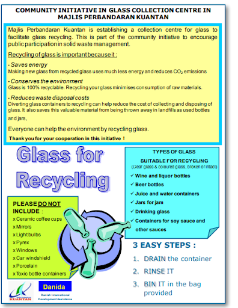

<!--StartFragment-->

Only clear and transparent glass bottle and jars are acceptable, rinse and dry before recycle

Electronic glass are not recyclable ( Exp: Light bulb, TV screen )\
Broken glasses are not encourage to recycle so far in Malaysia

Recycle trash car will take the glass but need to check the government websites for areas that are covered

<!--EndFragment-->

